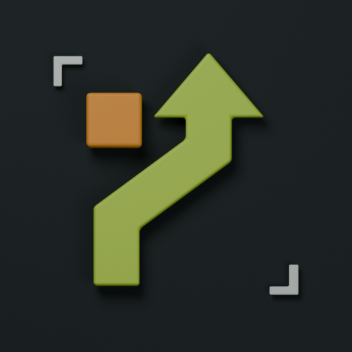
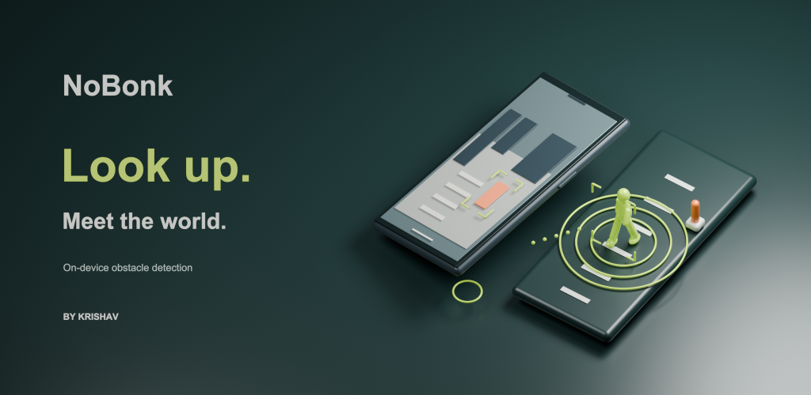
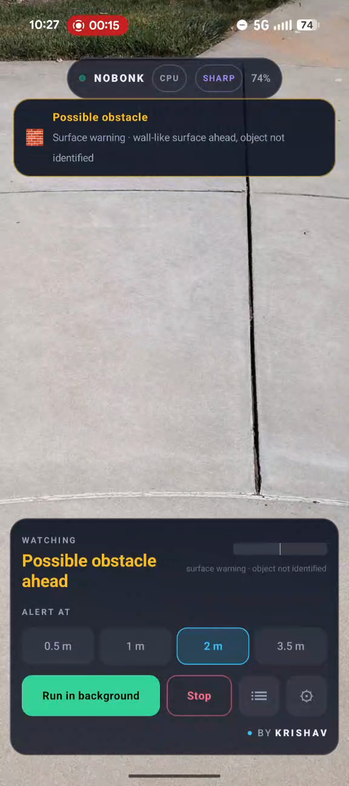
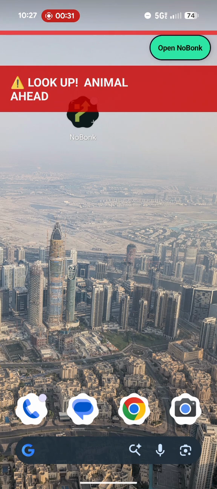

# NoBonk





**A little more awareness for the path ahead.**

NoBonk is Krishav’s Android project for an extra nudge to look up. It uses the rear camera and on-device AI to detect nearby people and obstacles, with vibration, sound and on-screen alerts. **Background use is the main Android experience:** start detection in NoBonk, then switch to the home screen or another app. NoBonk can miss or misidentify hazards and does not replace watching your surroundings.

[](https://github.com/krishavh/nobonk/actions/workflows/android.yml)


Built by **Krishav**, now a 9th grader, who started NoBonk as an 8th grader for the 2026 Alameda County Science & Engineering Fair (Project MS-SOFT-241) and is continuing it for the 2026 Congressional App Challenge.

> **Stay aware.** No alert does not mean the path is clear. Keep looking where you’re going.

## Awards

- 🥇 **1st Place** — STEM4All Science Fair 2026
- 🏆 **IEEE Award** — STEM4All 2026
- 🥉 **3rd Place (Category)** — Alameda County Science & Engineering Fair (ACSEF) 2026

## The problem

Krishav saw students at school bump into each other—or into walls—while looking at their phones. He wanted to explore whether the phone could give people a useful heads-up without requiring them to keep a dedicated camera app on screen. That observation shaped NoBonk’s focus on Android background detection.

## Set up in the foreground. Use it in the background.

1. **Open NoBonk to set up and test.** Acknowledge the safety reminder, allow the camera, check what your phone detects, and adjust sensitivity and sound, vibration or voice cues in a safe space.
2. **Choose Run in background on Android.** Allow the requested notification and overlay permissions, then switch apps. Keep the rear camera uncovered and pointed toward the scene.
3. **Receive alerts above other apps.** Use **Open NoBonk** to return to the settings. The app and notification include Stop controls; reliable shutdown is an active testing priority.

The foreground view is the Android setup and testing space; background operation is its primary intended use. The separate **iPhone prototype is foreground-only, detects people only, and is not yet available to download**. Android’s background camera behavior is not promised for iOS.

## Real Android screenshots

Unretouched frames from a developer-supplied phone recording—not mockups.

| Foreground: test and adjust settings | Background: alert over the home screen |
|---|---|
|  |  |

These show the interface in one test, not verified detection accuracy. [Watch the real walkthrough](https://nobonk.genwhy.ai/#background).

## Join the Android closed test

Use the same Google account to [join the tester group](https://groups.google.com/g/nobonk-android-testers), then [opt into the Google Play test and install](https://play.google.com/apps/testing/ai.genwhy.nobonk). Stay opted in for at least 14 consecutive days, try the app regularly, and send feedback to support@genwhy.ai. [Full testing instructions](https://nobonk.genwhy.ai/#testing-guide).

## How it works

1. **Camera** — the back camera captures frames in real time (up to ~10 fps, backing off to ~3 fps when the path has been clear for a while to save battery). Useful detections depend on holding the phone so the rear camera can see the scene; camera angle and lighting matter.
2. **On-device AI** — a YOLO26 model (nano or small; via ONNX Runtime with NNAPI/XNNPACK acceleration) detects people, animals, and obstacles in each frame. No internet needed.
3. **Distance estimation** — a pinhole-camera model converts bounding-box size to approximate distance; a box growing frame-over-frame means something is approaching.
4. **Approach tracking** — IoU tracking plus time-to-collision physics (`ApproachTracker.kt`) flags anything closing distance fast enough to hit you within ~2 seconds.
5. **Hazards the model can't classify** — `FrameAnalyzer.kt` detects blank walls (gradient-invariant adjacent-cell brightness analysis) and ground hazards like potholes and step-downs.
6. **Alerts** — escalating haptic + on-screen warnings (LOW / MEDIUM / HIGH) based on the alert distance you choose, plus a short synthesised chirp on MEDIUM/HIGH that is stereo-panned toward the hazard — with earbuds, someone approaching on your left is heard on your left. Sound and haptics can each be switched off.
7. **Detection history** — sessions, alert counts, peak-danger hours, and danger hotspots, stored only on your device.

## Alerts you can hear, feel and read

| Level | Screen | Haptic | Sound | Voice (opt-in) |
|---|---|---|---|---|
| LOW | amber bracket | single tap | — | — |
| MEDIUM | amber bracket + approach ring | double tap | soft double chirp | — |
| HIGH | red **LOOK UP** with side arrow and edge glow | triple buzz | urgent triple chirp | "Person on your left. Look up." |

Sound and voice are **stereo-panned toward the hazard** (constant-power pan law, 20 % centre dead-zone): with earbuds, left means left. All cues are individually switchable and persist across launches. On a dark scene NoBonk brightens the detector input (bounded "night boost") and tells you it is doing so. Design notes live in [`docs/ARCHITECTURE.md`](docs/ARCHITECTURE.md); the change history in [`docs/CHANGELOG.md`](docs/CHANGELOG.md).

## Privacy by design

- **No video or photos are ever recorded, stored, or transmitted.** Camera frames are processed in memory and immediately discarded — nothing from the camera is ever written to disk or sent anywhere.
- **Everything runs on-device.** There is no `INTERNET` permission and no network connection is used or required — the app works in airplane mode, so nothing *can* leave your phone.
- **The one thing NoBonk does store is a local detection-event history** (session stats + close-call hotspots), kept only in the app's private storage and never uploaded. You can clear it at any time from within the app.
- **Location is optional, approximate, and off by default.** If — and only if — you turn it on, NoBonk tags those history events with your *coarse* (approximate) location so the history screen can map roughly where your close calls happen. It stays *on your phone only*. Deny or leave it off and everything else still works.
- **`allowBackup` is disabled** (and backup/transfer rules explicitly exclude the history file) so nothing is swept into cloud backups.

> So "nothing recorded" means exactly that for **camera imagery** — no photos, no video, ever. The optional on-device event history (and its optional coarse-location tags) is the only thing persisted, it never leaves the device, and you can wipe it whenever you like.

## Measured results (Pixel 9a)

| Metric | Result |
|---|---|
| Detection accuracy (good lighting) | 80%+ |
| Detection accuracy (low light) | 3/10 — known limitation |
| Approach detection trials | 8/10 correct |
| Distance error at 1 m | ±30 cm |
| Battery drain (background mode) | ~10%/hr |

## Getting the model

The detector weights are **not** committed (large binaries; Ultralytics distributes them under AGPL-3.0). NoBonk ships the **YOLO26** family at 416 px (raw detection head; the app runs its own per-class NMS — measured faster than the end-to-end export, see `docs/MODEL_CHOICE.md`):

| Asset | Mode in app | Size | Notes |
|---|---|---|---|
| `yolo26n_416.onnx` | **Fast** (default for new installs) | ~9 MB | nano; best battery, everyday default on mid-range phones |
| `yolo26s_416.onnx` | **Sharp** | ~36 MB | small; sharper on far/small objects |

Install the exact shipped assets from the checksum-verified release bundle:

```bash
python3 scripts/install_verified_models.py
```

The exported graph outputs `[1, 84, 3549]` (cx, cy, w, h + 80 class scores per candidate); `ml/Nms.kt` keeps the eight classes NoBonk cares about and suppresses duplicates. Provenance, the AGPL §13 obligations, and why YOLO26 over the alternatives we evaluated (RF-DETR, D-FINE, YOLOX) are in [`docs/MODEL.md`](docs/MODEL.md) and [`docs/MODEL_CHOICE.md`](docs/MODEL_CHOICE.md).

## Try it on your phone (sideload)

A **test-signed** arm64 build of the current `main` is published for family testing at
`https://projects.oipie.com/apps/nobonk-arm64-testsigned.apk` (access-gated). It is the release build signed with a debug key so it installs directly:

1. Download the APK on the phone, open it, and allow "install unknown apps" for your browser when asked.
2. Grant **Camera**; grant **Notifications** and **Display over other apps** when you try *Run in background*.
3. Open ⚙ → **Cues** and tap **▶ Test** to feel/hear what an alert is like before you walk.
4. Watch the small `N fps · M ms` line under the status pill; those two numbers are what we want reported per phone.

Uninstall this test build before installing the Play version: they carry different signatures. Play builds are signed by the account holder from the AAB that CI produces on every push to `main`.

## Building it yourself

1. Install [Android Studio](https://developer.android.com/studio).
2. Clone this repo and open the folder in Android Studio.
3. Add a model file to `app/src/main/assets/` (see above).
4. Enable Developer Mode + USB debugging on your phone, connect it, and press **Run**.

From the command line:

- **Debug build / install:** `./gradlew assembleDebug` (a helper script, `build_and_install.sh`, builds and installs to a connected device).
- **Signed release bundle (for Play):** `./gradlew bundleRelease` produces `app/build/outputs/bundle/release/app-release.aab`. Signing reads keystore credentials from `~/.gradle/gradle.properties` or the `NOBONK_*` environment variables — **no secrets are committed**. See [`docs/RELEASE_CHECKLIST.md`](docs/RELEASE_CHECKLIST.md) for keystore generation and the full Play submission steps, and [`docs/PLAY_16KB_CHECK.md`](docs/PLAY_16KB_CHECK.md) for the required 16 KB native-library check (`scripts/check_16kb_alignment.sh`).

**Requirements:** builds against Android SDK 36 (compile/target API 36); runs on **Android 10+ (API 29)** and up. Best results on recent Pixel devices. iOS is not supported — Apple does not allow background camera access, which is the whole point of the app.

## Known limitations

- Works worse in low light (camera hardware limitation). A bounded night-boost gain on the detector input helps on dim streets, not in the dark.
- Distance estimates are approximate and depend on camera angle — the app warns you when the phone is held too flat. The estimate is calibrated to your phone's lens and sensor when the camera reports them.
- Older/slower phones may lag; walk at slow-to-medium speed.
- **NoBonk is a student-built safety prototype, not a certified safety device. It will miss things. Keep looking up.**

## Contributing

Issues and pull requests welcome! Some good areas to dig into: better low-light handling (learned denoise/enhance ahead of the detector), smarter alert descriptions, IoU-based multi-person ID matching, and a formal study on whether the app actually reduces near-misses. Check the open issues for known bugs.

## Acknowledgments

Created by **Krishav**.

**Haarith (Dad)** — Thank you for believing in this idea and sitting with me through the frustrating parts, especially when nothing seemed to work. Having you there made it easier to keep going. And thank you, Mom and Dad, for faithfully paying the increasingly ridiculous AI bills without asking too many questions :)

Krishav leads the project: identifying the problem, choosing the app's approach, shaping its privacy and alert behavior, and testing it on real phones.

**AI-assisted development.** NoBonk was built with substantial help from AI coding tools, directed and reviewed by Krishav. Much of the code was produced by these tools rather than typed by hand, and we credit them plainly:

- **Claude** (Anthropic) — substantial Kotlin implementation, performance work, model export, and release engineering.
- **OpenAI Codex** and **ChatGPT Astra** — code review and refactoring, the website, and Google Play setup.
- **Kaaval** — the family’s local AI coding setup, running across multiple **NVIDIA DGX Spark** systems. Over the months of development, it used a mix of **Qwen, DeepSeek and GLM 5.x** models to help with coding and build-and-test iterations. This is development infrastructure; the Android app does not send camera frames to Kaaval.
- **Google Gemini** — debugging, privacy/security review, and diagrams.
- **Warp** — terminal workflow and build scripting.

**Open-source technology.** Built with Android Studio, Jetpack Compose, CameraX, and ONNX Runtime. YOLO model weights from the official [Ultralytics](https://github.com/ultralytics/ultralytics) YOLO26 release (AGPL-3.0). Thanks to the Ultralytics, ONNX Runtime, and AndroidX teams.

## License

Licensed under the **GNU Affero General Public License v3.0** (AGPL-3.0) — see [LICENSE](LICENSE). AGPL-3.0 was chosen for compatibility with Ultralytics YOLO, which is itself AGPL-3.0. In short: use, modify, and share freely, but derivative works must remain open source under the same license, including over a network.

Because NoBonk ships an AGPL-covered YOLO model, publishing it on Google Play carries source-availability obligations (AGPL, including §13). The decision and the concrete obligations we meet — public source tagged per release, model/export-recipe availability, and an in-app open-source-licenses notice — are documented in [`docs/RELEASE_CHECKLIST.md` §6](docs/RELEASE_CHECKLIST.md). To keep the model reproducible for AGPL, **pin the `ultralytics` version** used for `yolo export` and record the upstream weights identifier when you add a model.
