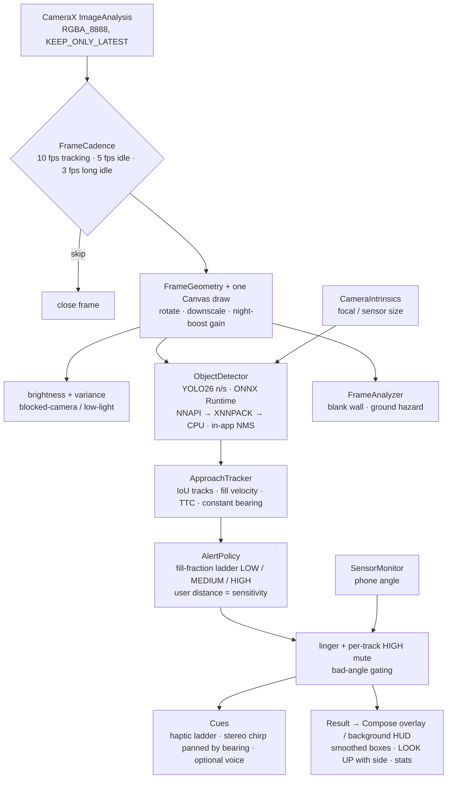

# NoBonk architecture

One frame, one path. Everything below runs on the phone; nothing touches the network.

## Modules

| Package | What lives there | Tested |
|---|---|---|
| `ml/FrameGeometry` | rotation + downscale plan, never upscales | ✅ |
| `ml/FrameCadence` | adaptive analysis interval | ✅ |
| `ml/LowLight` | blocked-camera, low-light, night-boost gain | ✅ |
| `ml/Letterbox`, `ml/Nms` | model input/output plumbing | ✅ |
| `ml/ObjectDetector` | ONNX Runtime session, EP fallback, raw-head or end-to-end decode, distance estimate | — (needs device) |
| `ml/CameraIntrinsics` | normalized focal from Camera2 characteristics | ✅ |
| `ml/ApproachTracker` | tracks, fill velocity, TTC, bearing tests | ✅ |
| `ml/AlertPolicy` | fill-fraction alert ladder | ✅ |
| `ml/AlertCue`, `ml/VoiceCue` | chirp synthesis + pan law, spoken phrase | ✅ |
| `ml/BoxSmoother` | display-only EMA | ✅ |
| `ml/DetectionEngine` | the single frame path shared by screen and service | — (Android) |
| `viewmodel/DetectionViewModel` | Compose state, persisted settings, fps | — |
| `service/DetectionService` | foreground camera service + WindowManager HUD | — |
| `ui/` | design system (`theme/Theme.kt`, `components/Ui.kt`), screens | — |

## Design principles

- **Safety logic never waits on presentation.** Smoothing, cadence back-off and cue rate limits act on the display and on power, never on the ladder that decides HIGH.
- **Escalate instantly, de-escalate slowly.** Linger, per-track mute and N-of-M bearing tests remove flicker without adding latency to the first warning.
- **Everything the phone can tell us, we use.** Focal length, sensor size, orientation sensors, battery — all read locally, none stored.
- **Privacy is structural.** No `INTERNET` permission in the merged manifest (library-injected ones are stripped), no frame ever leaves memory, history is local and deletable.
